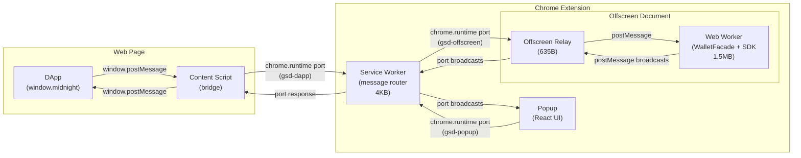

# G.S.D. Wallet

There was a [bug](https://github.com/adamreynolds-io/gsd-wallet/issues/10), so I built this...then people liked it and it took on a life of its own. My pain is your gain. If you're developing on Midnight, then this is the best wallet for you.

<p align="center">
  
</p>

Chrome extension wallet for dApp developers building on the [Midnight](https://midnight.network) blockchain. Designed for testing and debugging on Undeployed (local), DevNet, QANet, Preview, PreProd, and Mainnet environments.

**This is not a production wallet.** Seeds are stored unencrypted. Use it to develop and test your dApps, not to hold real funds.

A personal project by [Adam Reynolds](https://github.com/adamreynolds-io), Engineering Manager, Platform & Tooling @ [Shielded Technologies](https://shielded.io).

## Who is this for?

- **dApp developers** testing contract deployments, token transfers, and DApp connector integration
- **QA engineers** verifying wallet behavior across Midnight environments
- **SDK integrators** building their own Midnight wallet (see [Integration Guide](docs/WALLET-INTEGRATION-GUIDE.md))

## Install

**Option A — pre-built (recommended):**

Download `dist.zip` from the [latest release](https://github.com/adamreynolds-io/gsd-wallet/releases/latest), unzip, go to `chrome://extensions`, enable Developer Mode, click "Load unpacked", select the `dist/` folder.

**Option B — build from source:**

```bash
pnpm install
pnpm build
```

Load `dist/` as above.

## Features

- **Multi-environment** — Undeployed (localhost), DevNet, QANet, Preview, PreProd, Mainnet
- **Wallet menu** — unified dropdown with wallets grouped by network, create/switch/delete/copy-seed
- **Quick-start on localnet** — one-click genesis wallets (W0-W3) with prefunded NIGHT
- **Multi-wallet** — multiple wallets per environment, each with isolated sync state and indexed names
- **Shielded & unshielded transfers** — send tokens with ZK proving via server prover
- **Dust operations** — register/deregister UTXOs for dust generation
- **DApp connector** — `window.midnight` injection implementing the Midnight DApp connector API
- **Custom endpoints** — override Node, Indexer, and Prover URLs per environment

### Sync & diagnostics

- **Non-blocking sync** — UI renders immediately while the wallet syncs in the background
- **Per-wallet sync progress** — Shielded/Unshielded/Dust progress in the status bar and debug tabs
- **Sync phase in header** — Connecting/Syncing X%/Stalled/Synced displayed next to the wallet name
- **Stall detection** — automatic detection when sync stops advancing for 30s
- **SDK console interception** — captures `@polkadot/api` RPC-CORE errors and WebSocket disconnects
- **Persistent diagnostics** — 2000-event ring buffer persisted to `chrome.storage.local`; survives extension reloads and SW restarts
- **Filterable event stream** — filter by level (DBG/INF/WRN/ERR) and category (SW/Wallet/State/Sync/SDK/DApp/API/Pop/Tx/Idx/Sto/Err/Conn)
- **Log export** — download all diagnostic events as NDJSON with ISO timestamps
- **Failed tx download** — when a transaction fails, download a self-contained JSON diagnostic file with full tx hex, deserialization markers, ledger params, error details, and package versions
- **TX heartbeat** — 10s liveness heartbeats during long-running operations; pauses during CPU-bound WASM steps
- **Debug tabs** — real-time sync progress, UTXO inspection, token balances per subsystem, transaction history
- **Built-in explorer** — query the v4 indexer for transaction, block, and contract details
- **Shared event cache** — network events cached in IndexedDB, shared across wallets on the same network
- **Bundled mainnet snapshot** — 88k pre-built events for zero-download first sync
- **Cache export** — download event cache as NDJSON for sharing or backup
- **Per-type sync progress** — individual cache/live source, events/second rate, and ETA per wallet subsystem (e.g. `Shielded 68% cache | 505 evt/s ~56s`)

## Architecture

```
DApp <-> content script <-> service worker (4KB) <-> offscreen relay (635B) <-> Web Worker (1.5MB SDK)
```



The SDK runs in a **Web Worker** spawned by an offscreen document. Chrome does not monitor Workers for responsiveness, so heavy SDK operations (balancing, proving) never trigger "Page Unresponsive" dialogs.

| Component | Role |
|-----------|------|
| **Service worker** | Thin message router — popup/dApp port management, session handling, state caching |
| **Offscreen document** | Stateless relay between SW port and Worker via `postMessage` |
| **Web Worker** | Hosts WalletFacade, all SDK operations, sync, checkpoints, diagnostics |

The offscreen document initiates the port connection to the SW. When Chrome restarts the SW, the offscreen detects the disconnect and reconnects automatically. The Worker (and SDK state) survives SW restarts.

### Persistent SDK storage

SDK wallet state is checkpointed to IndexedDB on sync completion and wallet stop. On browser restart, the wallet restores from checkpoint and resumes syncing from the last saved position.

Network events (shielded ZSwap and dust events) are cached in IndexedDB per-network and shared across all wallets on the same network. A bundled mainnet cache snapshot (88k events) ships with the extension — imported into IndexedDB in ~5s on first install, eliminating the network download for cached events.

The offscreen document is persistent — Chrome does not garbage-collect it. No keepalive hacks are needed.

## Glossary

| Term | Definition |
|------|-----------|
| **NIGHT** | Native token of the Midnight blockchain, used for transaction fees and transfers. |
| **DUST** | On-chain resource (not a token) generated by registered NIGHT UTXOs. Accumulates passively and is consumed as transaction fees. Cannot be transferred between addresses. |
| **Stars** | Smallest indivisible unit of NIGHT. 1 NIGHT = 10⁶ stars. All SDK and ledger NIGHT values are expressed in stars. |
| **Specks** | Smallest indivisible unit of DUST. 1 DUST = 10¹⁵ specks. All SDK and ledger DUST values are expressed in specks. |
| **Shielded** | Transactions and balances protected by zero-knowledge proofs. The indexer never sees addresses or amounts — the wallet filters events locally using private viewing keys. |
| **Unshielded** | Transparent on-chain transactions and balances visible to all observers. The indexer can filter by address without privacy risk. |
| **ZK / Zero-Knowledge** | Cryptographic proofs that verify a statement (e.g. "I own enough funds") without revealing the underlying data. Midnight uses ZK proofs for shielded transactions, generated by a local or remote proof server. |
| **Facade** | The `WalletFacade` class from `@midnight-ntwrk/wallet-sdk-facade`. Manages wallet state, sync subscriptions, and exposes the API surface used by the Web Worker. |

## How sync works

The wallet syncs three subsystems independently:

| Subsystem | What it syncs | Why |
|-----------|--------------|-----|
| **Shielded** | All ZSwap events on chain | Privacy — wallet filters locally so the indexer never sees your viewing keys |
| **Unshielded** | Only your transactions | Public — indexer can filter by address without privacy risk |
| **Dust** | All dust events on chain | Same privacy model as shielded — local filtering |

**First sync is slow on mainnet** (~89k shielded + ~89k dust events), but a bundled cache snapshot ships with the extension — fresh install syncs from local cache in ~3 min, down from 6+ min from the indexer. The unshielded subsystem syncs instantly.

> **v0.9.0:** The custom ledger WASM (`@midnight-ntwrk/zkir-v2` with `replayEventsFromRaw` bulk replay) has been removed. The wallet now uses the official `@midnight-ntwrk/ledger-v8` WASM exclusively. The bulk replay code path is still present and will activate automatically if a future SDK release adds `replayEventsFromRaw` support.

Two-phase initialization ensures the UI is never blocked:
1. **Phase 1 (fast):** Load checkpoint, create facade, subscribe to state, emit initial state to UI
2. **Phase 2 (background):** `facade.start()` connects to indexer/node, sync resumes; state updates flow progressively

## Transaction Behavior

Transactions in the wallet serialize through a single queue — only one transaction runs at a time per wallet. This applies to both dApp-initiated and browser-initiated (UI) transactions; they share the same queue.

| Behavior | Detail |
|----------|--------|
| **Serial execution** | Transactions run one at a time. A second call blocks until the first completes or times out. |
| **30-minute TTL** | Every transaction has a 30-minute deadline. Sessions also expire after 30 minutes of inactivity. If a transaction does not complete within this window, the operation fails and the error is reported to the caller. |
| **No automatic retry** | Failed transactions are not retried. The caller (dApp or UI) must handle the failure and resubmit if appropriate. |
| **Wallet switch cancels in-flight ops** | Switching the active wallet (or environment) stops the current `WalletFacade`, cancels any in-flight operations, and clears all active dApp sessions. A transaction in progress at switch time will fail with an error. |
| **Shared queue** | DApp calls via `GSD_API_CALL` and browser-initiated operations (transfers, dust registration) both route through the same offscreen worker. They cannot run concurrently. |

## Quick start

### Localnet

```bash
pnpm localnet:up    # starts node + indexer + proof server
```

Select "Undeployed" environment, click W0 to import the genesis wallet with all minted NIGHT, deploy and test your contracts.

```bash
pnpm localnet:down  # stop all services
pnpm localnet:logs  # tail service logs
pnpm localnet:reset # nuke volumes and restart fresh
```

### Testnet / Mainnet

1. Start a proof server: `docker run -d -p 6300:6300 ghcr.io/midnight-ntwrk/proof-server:8.0.3 midnight-proof-server -v`
2. Select your target network
3. Import your funded wallet seed
4. Your dApp can discover the wallet via `window.midnight`

**Tip:** Click the expand icon in the header to open in a full browser tab.

## DApp connector

The wallet injects `window.midnight[uuid]` on all pages and dispatches `midnight#ready` for discovery.

**17 API methods:** `getShieldedBalances`, `getUnshieldedBalances`, `getDustBalance`, `getShieldedAddresses`, `getUnshieldedAddress`, `getDustAddress`, `getConfiguration`, `getConnectionStatus`, `makeTransfer`, `balanceUnsealedTransaction`, `balanceSealedTransaction`, `submitTransaction`, `signData`, `getTxHistory`, `hintUsage`, `getProvingProvider`, `makeIntent`.

## Midnight GSD Connect (socket integration)

Node.js applications can interact with the wallet via WebSocket using the `gsd-wallet-connect` package (`packages/gsd-socket`). The included [example](packages/gsd-socket/example.ts) deploys a Compact counter contract through the wallet and reads on-chain state:

```
$ cd packages/gsd-socket && ./node_modules/.bin/tsx example.ts

Listening on ws://127.0.0.1:6372 — enable socket in wallet...
Wallet connected.

Network:  undeployed
Indexer:  http://localhost:8088/api/v4/graphql
Prover:   http://localhost:6300
Dust:     cap=1250000000000000000000000 balance=1250000000000000000000000

Deploying counter contract (initial privateCounter=0)...
Contract: 6bc431b20ffb9404571d8d07470f63611327173f8d4e446553fd966a691d743c
On-chain round: 0

Done. Check the wallet diagnostics panel — filter by "Conn" to see trace events.
```

Click the socket icon in the wallet header to enable. The extension connects as a WebSocket client to your Node.js server and routes all requests through the same DApp connector pipeline (session tracking, validation, diagnostics). Trace events from the script appear in the diagnostics panel under the "Conn" category — including witness definitions, private state, and contract addresses.

See [Integration Guide](docs/WALLET-INTEGRATION-GUIDE.md#15-gsd-connect-socket-integration) for the full API reference.

## Explorer

| Input | Lookup |
|-------|--------|
| Number (e.g. `121972`) | Block by height |
| 64-char hex | Transaction by hash, falls back to contract |

## Network configuration

| Environment | Node RPC | Indexer |
|---|---|---|
| Undeployed | `localhost:9944` | `localhost:8088/api/v4/graphql` |
| DevNet | `rpc.devnet.midnight.network` | `indexer.devnet.midnight.network/api/v4/graphql` |
| QANet | `rpc.qanet.midnight.network` | `indexer.qanet.midnight.network/api/v4/graphql` |
| Preview | `rpc.preview.midnight.network` | `indexer.preview.midnight.network/api/v4/graphql` |
| PreProd | `rpc.preprod.midnight.network` | `indexer.preprod.midnight.network/api/v4/graphql` |
| Mainnet | `rpc.mainnet.midnight.network` | `indexer.mainnet.midnight.network/api/v4/graphql` |

Proof server: `localhost:6300` for all environments.

## Security

Intentional trade-offs for developer convenience:

| Area | Status |
|---|---|
| Seed storage | Plaintext in IndexedDB — do not use for real funds |
| Password protection | Disabled |
| DApp connections | Auto-approved, no user confirmation |
| Transaction signing | Auto-signed — `BYPASS:` warnings emitted to diagnostics |
| Data signing | Auto-signed — `BYPASS:` warnings emitted to diagnostics |
| CSP | `wasm-unsafe-eval` required for Midnight SDK WASM |

Seed material is zeroed after use in the Worker. Wallet IDs are derived from SHA-256 of the seed (never raw seed bytes in logs or storage keys).

All operations that a production wallet would prompt the user for (connection approval, transaction signing, data signing, transaction submission) emit `BYPASS:` warnings at `warn` level in the diagnostic stream. Filter diagnostics by "BYPASS" to see exactly when approval would have been requested.

## Known issues

- **Mainnet RPC disconnects** — The mainnet RPC node periodically drops WebSocket connections with `1000: Normal Closure`. The SDK reconnects automatically but sync can stall temporarily.
- **First mainnet sync takes ~3 min** — ~89k shielded + ~89k dust events replayed from the bundled cache snapshot. Was 6+ min from indexer. Subsequent opens resume from per-wallet checkpoints.

## Documentation

- [Integration Guide](docs/WALLET-INTEGRATION-GUIDE.md) — lessons learned building this wallet, platform constraints, SDK gaps
- [SDK Reference](docs/sdk-reference/) — wallet-sdk v3.0.0 architecture, package APIs, code examples

## Dependencies

| Category | Packages |
|---|---|
| Midnight SDK | `wallet-sdk-facade` 3.0.0, `wallet-sdk-hd` 3.0.1, `ledger-v8` 8.0.3, `dapp-connector-api` 4.0.1 |
| UI | React 19, React Router 7, Zustand 5, Tailwind CSS 4 |
| Storage | `idb` (IndexedDB), RxJS 7 |
| Build | Vite 8, `@crxjs/vite-plugin` 2.4.0, TypeScript 6 |
| Crypto | `@scure/bip39` |

## License

Apache License 2.0. See [LICENSE](LICENSE).
